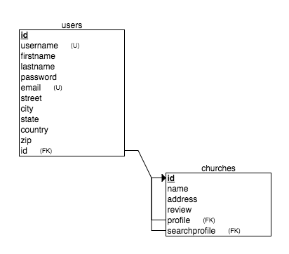

# CHURCHFINDR
An application that finds local churches or churches using a zip code, with YELP reviews to help the user to find a comfortable fit. Possibly use Google Reviews if it is tied into the Maps API.

LIVE! https://churchfindr.herokuapp.com/

### WIREFRAMING

https://trello.com/b/eZZITrSf/churchfindr-find-a-church-near-you

**KEY:**
* Green Labels: Completed
* Yellow Labels: Ongoing
* Red Labels: Important

### USER STORIES
1. A user vists the application
2. A user reads the description of the application
3. A user can then browse different aspects of the website to find out more on functionality
4. An unregistered user is prompted to Register
5. Once user is registered you can locate churches around your location

### API
* Google Places API

### LANDING PAGE
1. The user will see a brief description of the app and its functions
2. From there the user can register
    * Mandatory: first name, last name, Email, Password, etc..
3. Login
4. Logout

### API USAGE
* Utilize Google Places API to locate churches around the user

### MVP
1. ~~Theme~~
2. ~~Proper routing/views/css~~
3. ~~Registration/Login/Logout~~
4. ~~Connect and store users in a database~~
    * ~~Retrieving information as well~~
5. ~~Using Google Places API to locate churches~~

### WISH LIST (BACK LOG)
1. Incorporating Google Reviews
2. ~~Leave reviews in the app~~
3. ~~Save visited churches to profile~~
4. ~~Text a user the address of the church they chose~~
5. ~~Give each user unique searches, pretty much two users don't see what the other searched~~

### TECHNOLOGIES USED
1. HTML/CSS/Javascript
2. Node.js
3. Express
4. PostgreSQL Databases
5. Postman for Google Places Endpoint testing

### DATABASE SCHEMA
1. psql -f models/schema.sql
2. https://gist.github.com/GainorB/5b430fda91e2e246e67dbe05b7f6a272
3. 

### C.R.U.D FUNCTIONALITY
1. Need to create an account to be able to CRUD.
    * Create: Searching for a church will create 9-10 rows in the database.
    * Read: A search will return 9-10 churches from the database.
    * Update: With a profile, you can SAVE a church to your Profile, then leave a Review. Both actions alter the database.
    * Delete: You can delete a record from your profile/database.

### NODE MODULES
1. Passport
    * To build a User System with authentication
    * Registration Form to store User's preferences
2. Axios (CRUD)
    * Library used to interact with the server. (send and receive information)
3. PG-Promise
    * Used to read SQL queries on Node
4. Logger
    * Terminal logger
5. Express Validator
    * Used to validate input from form submission
6. Body-Parser
    * Parse HTML and receive json object based on inputs on the server
7. DotENV
    * Allows .env support
8. bluebird
    * A promise library that is quick, easy to debug and full of features
9. Express
    * Used with Node.js
10. Path
    * Used to set up public folder for static files.
11. Express Session
    * Used to enable sessions, to track users activity and to keep users logged in.
12. CORS
    * Used to manage Cross Origin issues
13. Request
    * Make HTTP calls (Used to GET Google API)
14. Twilio
    * Send SMS Using Twilio Node Module

### DOWNLOAD PROJECT & INSTALL
1. Git clone or download this project
2. Open up Terminal or Command line
3. Navigate to the directory where the project was cloned or downloaded to
4. Run this command: psql -f models/schema.sql
5. This command will create a PostgreSQL database along with the tables
6. To run the application, you need to install the dependencies, run this command: npm install --save
7. To start the application, run this command: npm start
8. The application will run at: localhost:3000, if that port is already in use, run this command: PORT=1738 npm start
9. This command will start the server at: localhost:1738